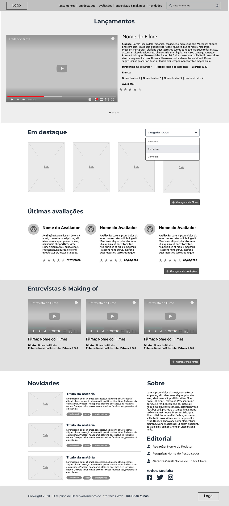

<div align="center">
  
  <h1>Ripe Tomatoes</h1>
  <h3>O seu portal de filmes nada original</h3>
  <!--<div align="center">
    &nbsp;&nbsp;
    
  </div>-->
  
  
  
  
</div>

<p align="center">
  <a href="#projeto">Projeto</a>&nbsp;&nbsp;&nbsp;|&nbsp;&nbsp;&nbsp;
  <a href="#layout">Layout</a>&nbsp;&nbsp;&nbsp;|&nbsp;&nbsp;&nbsp;
  <a href="#tecnologias">Tecnologias</a>&nbsp;&nbsp;&nbsp;|&nbsp;&nbsp;&nbsp;
  <a href="#como-usar">Como usar</a>
</p>

### Projeto

O Ripe Tomatoes é um portal de filmes desenvolvido para fins educacionais. O objetivo é trabalhar as skills básicas do desenvolvimento web, consolidando o conhecimento base.
Através do portal, o usuário é capaz de visualizar informações de uma base de filmes, atualizada constantemente. Informações como elenco, diretor e data de lançamento também podem ser encontradas na página.


### Layout

Toda a construção de branding e styleguide da aplicação foi de responsabilidade do desenvolvedor. O projeto foi desenvolvido de acordo com o wireframe disponibilizado pelos professores, e pode ser observado abaixo.



### Tecnologias

Ripe Tomatoes é uma aplicação simples, que utiliza linguagens fundamentais para o desenvolvimento front-end, como mostrado abaixo.

| **Estrutura** | **Estilização** | **Funcionamento** |
|--|--|--|
| HTML5 | CSS3 | JavaScript |

Também foi utilizado o framework [Bootstrap](https://getbootstrap.com/), para tornar o desenvolvimento da UI mais simples, e de forma responsiva.
O projeto consome a API [The Movie Database (TMDB)](https://www.themoviedb.org/) para extrair os dados de todos os filmes.


### Como usar

1. Baixe o repositório do projeto e entre na pasta local, usando os comandos abaixo.
```bash
git clone https://github.com/mayrinkdotcom/ripe-tomatoes.git
cd ripe-tomatoes
```
2. Para iniciar o server local, você irá precisar do live-server instalado. Se ainda não o tiver, digite o seguinte comando no terminal:
```bash
npm install -g live-server
```
3. Finalmente, digite o comando para iniciar o server do projeto:
```bash
live-server
```

Portal de filmes desenvolvido para a obtenção de pontos referentes à disciplina de Desenvolvimento de Interfaces Web na PUC Minas.
